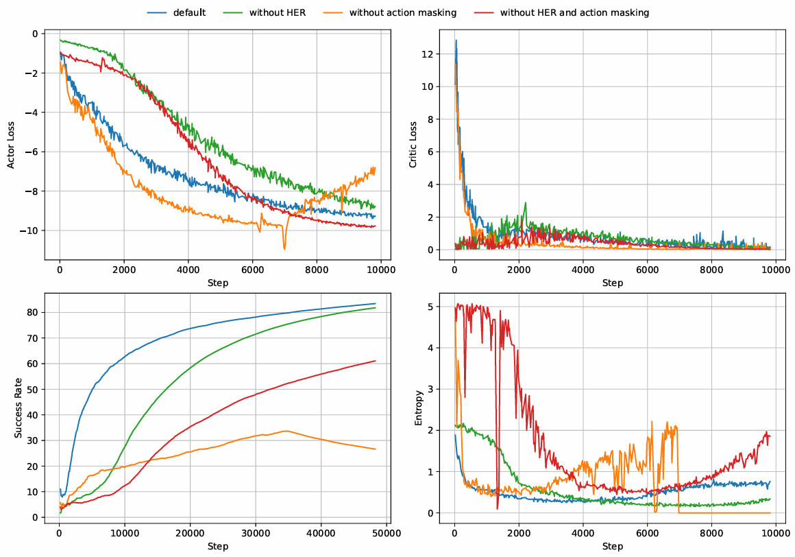
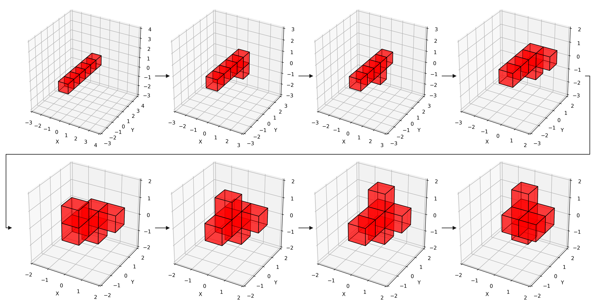

[**ENGLISH**](README.md) | [**中文**](./README_assets/README_CN.md)

<h1 align='center'> A Goal-Oriented Reinforcement Learning-Based Path Planning Algorithm for Modular Self-Reconfigurable Satellites </h1>

This project is the official implementation of the paper ["A Goal-Oriented Reinforcement Learning-Based Path Planning Algorithm for Modular Self-Reconfigurable Satellites"](https://arxiv.org/abs/2505.01966). The pretrained models used in the paper can be found on [Google Drive](https://drive.google.com/drive/folders/1BEaaR3Lnek-0xkoX-hGmv-avGyU0FabS?usp=drive_link).

## Dependencies

```bash
conda create -n sat python=3.9
conda activate sat
git clone https://github.com/perfactliu/GORL4MSRS.git
cd GORL4MSRS
pip install -r requirements.txt
```

## Quick Start
Download the pretrained models from [Google Drive](https://drive.google.com/drive/folders/1BEaaR3Lnek-0xkoX-hGmv-avGyU0FabS?usp=drive_link) and place them into the "\checkpoints" folder.
Run the following command in the terminal to test the reconfiguration strategy of a 4-module satellite over 5 episodes with random target configurations:
```bash
python test.py
```
You can also adjust parameters to test more episodes or disable visualization:
```bash
python test.py --test-episodes=100 --no-plot
```
If you want to test the 6-module case, you need to make the following changes:
- Modify "\environments\satellite_config.yaml" to the 6-module configuration
- Run the following command in the terminal:
```bash
python test.py --model-name='agent_6_sat'
```

## Reproducing the Paper
Training the reconfiguration policy model for a 4-module satellite:
```bash
python train.py \
  --n-epochs 500 \
  --n-batch 200 \
  --batch-size 256 \
  --model-name your_model_name_for_4_agent \
  --change-goal-cycle 10 \
  --max-cycle-steps 16 \
  --target-update-freq 3 \
  --log-alpha -2.0 \
  --log-dir logs/your_log_dir_for_4_agent
```
Training the reconfiguration policy model for a 6-module satellite:
```bash
python train.py \
  --n-epochs 1200 \
  --n-batch 500 \
  --batch-size 512 \
  --model-name your_model_name_for_6_agent \
  --change-goal-cycle 15 \
  --max-cycle-steps 25 \
  --target-update-freq 5 \
  --log-alpha -1.0 \
  --log-dir logs/your_log_dir_for_6_agent
```
**Before changing the number of modules (environment), be sure to modify the environment configuration file (satellite_config.yaml).**

## Algorithm Performance

### Comparative Experiments

<div align="center">
  
</div>

### Visualization

<div align="center">
  
</div>

## Citation
```bibtex
@misc{liu2025goalorientedreinforcementlearningbasedpath,
      title={A Goal-Oriented Reinforcement Learning-Based Path Planning Algorithm for Modular Self-Reconfigurable Satellites}, 
      author={Bofei Liu and Dong Ye and Zunhao Yao and Zhaowei Sun},
      year={2025},
      eprint={2505.01966},
      archivePrefix={arXiv},
      primaryClass={cs.RO},
      url={https://arxiv.org/abs/2505.01966}, 
}
```