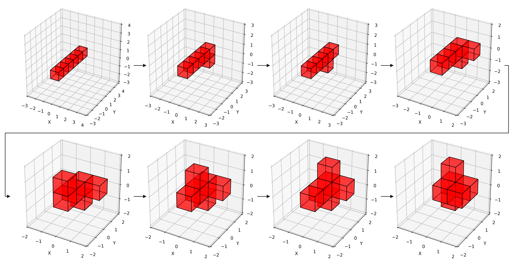

[**ENGLISH**](../README.md) | [**中文**](README_CN.md)

<h1 align='center'> 基于目标导向强化学习的模块化可重构卫星路径规划算法 </h1>

本项目是论文["A Goal-Oriented Reinforcement Learning-Based Path Planning Algorithm for Modular Self-Reconfigurable Satellites"](https://arxiv.org/abs/2505.01966)的源代码实现。针对论文中使用的预训练模型可以在[Google Drive](https://drive.google.com/drive/folders/1BEaaR3Lnek-0xkoX-hGmv-avGyU0FabS?usp=drive_link)获取。

## 依赖项

```bash
conda create -n sat python=3.9
conda activate sat
git clone https://github.com/perfactliu/GORL4MSRS.git
cd GORL4MSRS
pip install -r requirements.txt
```

## 快速开始
从[Google Drive](https://drive.google.com/drive/folders/1BEaaR3Lnek-0xkoX-hGmv-avGyU0FabS?usp=drive_link)下载预训练模型，放入"\checkpoints"文件夹中。\
在终端运行下面指令，以测试5轮4个模块卫星对于随机目标构型的重构策略：
```bash
python test.py
```
你也可以调整参数测试更多的轮数或是禁用可视化：
```bash
python test.py --test-episodes=100 --no-plot
```
如果希望测试6个模块的情况，你需要做出如下更改：
- 修改"\environments\satellite_config.yaml"为6个模块情况
- 在终端运行下面指令：
```bash
python test.py --model-name='agent_6_sat'
```

## 论文复现
4个模块卫星重构策略模型训练：
```bash
python train.py \
  --n-epochs 500 \
  --n-batch 200 \
  --batch-size 256 \
  --model-name your_model_name_for_4_agent \
  --change-goal-cycle 10 \
  --max-cycle-steps 16 \
  --target-update-freq 3 \
  --log-alpha -2.0 \
  --log-dir logs/your_log_dir_for_4_agent
```
6个模块卫星重构策略模型训练：
```bash
python train.py \
  --n-epochs 1200 \
  --n-batch 500 \
  --batch-size 512 \
  --model-name your_model_name_for_6_agent \
  --change-goal-cycle 15 \
  --max-cycle-steps 25 \
  --target-update-freq 5 \
  --log-alpha -1.0 \
  --log-dir logs/your_log_dir_for_6_agent
```
**更换模块数量（环境）前，一定要修改环境配置信息（satellite_config.yaml）**

## 算法性能

### 对比实验

<div align="center">
  
</div>

### 可视化

<div align="center">
  
</div>

## 引用
```bibtex
@misc{liu2025goalorientedreinforcementlearningbasedpath,
      title={A Goal-Oriented Reinforcement Learning-Based Path Planning Algorithm for Modular Self-Reconfigurable Satellites}, 
      author={Bofei Liu and Dong Ye and Zunhao Yao and Zhaowei Sun},
      year={2025},
      eprint={2505.01966},
      archivePrefix={arXiv},
      primaryClass={cs.RO},
      url={https://arxiv.org/abs/2505.01966}, 
}
```